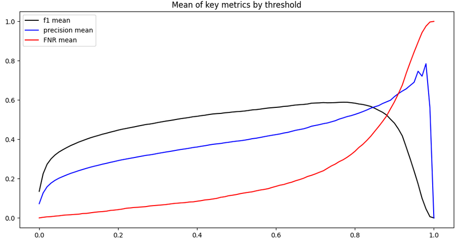
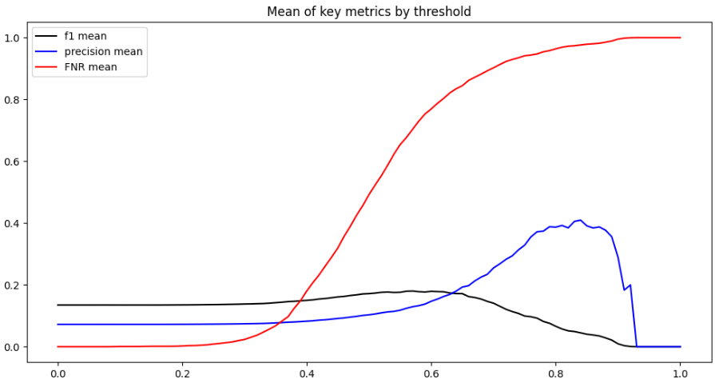

# Term Deposit Marketing - A prediction based on customer and marketing data 

**Author Remark**: Although KPI of the project host is satisfied, this project is still under development as the author is not yet satisfied with the result. 

## Raw Data 

Features:

* age : age of customer (numeric)
* job : type of job (categorical)
* marital : marital status (categorical)
* education (categorical)
* default: has credit in default? (binary)
* balance: average yearly balance, in euros (numeric)
* housing: has a housing loan? (binary)
* loan: has personal loan? (binary)
* contact: contact communication type (categorical)
* day: last contact day of the month (numeric)
* month: last contact month of year (categorical)
* duration: last contact duration, in seconds (numeric)
* campaign: number of contacts performed during this campaign and for this client (numeric, includes last contact)

Target:

* y - has the client subscribed to a term deposit? (binary)

## Data Tranformation 

| data | type | cyclical | encoding options | category | fall back |
|------|------|----------|------------------|----------|-----------| 
| age | numeric | NO | 1, keep as is 2, target encoding | personal | knn mean |
| job | categorical | NO | 1, one hot 2, target encoding| personal | mean |
| marital | categorical | NO | 1, one hot 2, target encoding | personal | mean |
| education | ordinal categorical | NO | 1, ordinal 2, target encoding | personal | mean | 
| default | binary | NO | 1, one hot 2, target encoding | personal | mean | 
| balance | numeric | NO | 1, log 2, target encoding | personal | knn mean | 
| housing | binary | NO | 1, one hot 2, target encoding | personal | mean | 
| loan | binary | NO | 1, one hot 2, target encoding | personal | mean | 
| contact | categorical | NO | 1, one hot 2, target encoding | campaign | mean | 
| day | numeric | YES | 1, keep as is 2, target encoding | campaign | knn mean | 
| month | categorical | YES | 1, one hot 2, target encoding | campaign | knn mean | 
| day of year (engineered) | numeric | YES | 1, keep as is 2, target encoding | campaign | knn mean | 
| duration | numeric | NO | 1, log 2, target encoding | campaign | knn mean | 
| campaign | numeric | NO | 1, keep as is 2, target encoding | campaign | knn mean | 

* Remark: There will be an option to "clean binary" since we only need to keep one of "{binary feature}_1", "{binary feature}_0", and "{binary feature}_target".

See detail at [this notebook](./note_books/data_transforming.ipynb) and [this notebook](./note_books/EDA_transform.ipynb), the code for data transforming can be seen at [this file](./proj_mod/data_processing.py). 

## Goal and KPI 

**Goal**: Predict if the customer will subscribe (yes/no) to a term deposit (variable y)

**Author's Personal KPI**: ($5$-fold) Cross validation mean of F1 score (at $0.5$ threshold, and in general), ROC-AUC, and Average Precision, where the latter two are preferred-they "represent" tradeoffs more. 

**Project Host KPI**: Hit %81 or above accuracy by evaluating with $5$-fold cross validation and reporting the average performance score.

**Author Remark**: 
* When we speak of data splitting, we are talking about (target based) stratified splits. 
* The dataset has imbalanced target ($\approx$ 93 percent negative), so using accuracy score as KPI will be misleading - For instance, I can get $93$ percent accuracy by just assuming everyone is not subscribing. This is why I opted for F1 score, ROC-AUC, and Avergae Precision metrics as they are more appropriate in context of imbalanced dataset. 

## Baseline (trivial) model 

We will be using the "trivial" assuming everyone is positive as baseline model. This is decided due to context at hand: The companies is assuming everyone is likely to be a customer when starting the marketing campaign. 

The target is imbalanced, there are $7.24\%$ positive. Using accuracy is kinda meaning less here, so we will be using f1 score as our KPI, we will also rely on roc auc, and average precision as well (when comparing between models other than against the trivial model). 

By construction, the f1 score of the baseline model is $\frac{2*7.24}{2*7.24 + 92.76} \approx 0.1350$. 

## Imbalance handling 

As observed, the target is imbalanced, the author mainly handle the imbalance issue through weight adjustment within different models. The author has also attempted random under, and over sampler. The under sampler produced inferior result, while the over sampler is consuming too much ram to be continued. 

The author plan to investigate into otherwise sampling methods (e.g. SMOTE sampling), and finding ways to make random samplers work well, if time permits. 

## Result Summary 

The best (according to $5$-fold cross validation mean of F1 score at $0.5$ threshold, ROC-AUC, and AP) model (pipeline) is xgboost classifier based using all features (both "personal" and "campaign" features). It produced the following key metrics by threshold 

With $5$-fold cross validation mean of 

* F1 at $0.5$: $0.5406$
* ROC-AUC: $0.9510$ 
* Average Precision: $0.5681$

See detail at [this notebook](./note_books/xgboost.ipynb), where it is clarified that above model satisfies the host KPI as well - with about $89$ percent  ($5$-fold cross validation mean of) accuracy score at $0.5$ threshold. 

**For context**: 

At a specific threshold, if the user only target the potential customer that the model claim will subscribe: 

* Precision: The proportion of actual subscriber within targeted potential customers. 
* FNR: The proportion of lost actual subscriber among all actual subscribers. 

Picking the threshold is a tradeoff between above two metrics - The more actual subscriber the user want to target, the more actual subscriber the user will miss out. 

## Tech Stack 

Python packages: 
* pandas, numpy - for data manipulations 
* seaborn, matplotlib - for data visualizations 
* sklearn - for model pipelines and training 
* xgboost - for xgboost model 
* cloudpickle - for making record 
* imblearn - for sampler to handle target imbalance 

## Training and cross validation method 

The code can be seen at [this file](./proj_mod/training.py). 
The key is the "model_eval" class object. It takes in the whole feature and target dataset, a model pipeline, an outer cv split, and a parameter dictionary. 
During training, for each training fold, the algorithm will create an inner cv within the training split and find the best hyperparameter for the pipeline according to the parameter dictionary, then the best estimator, its output (in probability form), and KPI will be recorded before the algorithm repeat the same procedure for the next training and testing split. 

The key is that, the algorithm, essentially, record the "best" estimator done by inner cross validation according to each training set and test it on the corresponding testing set. 

The "model_eval" class object also have methods that save the trained data, load data, produce different metrics by threshold, and produce graphics of metric by threshold. 

One can see it applied in practice in, for instance, [this file](./note_books/xgboost.ipynb). 

## Author's discontent, and future plans 

The features have two categories - the "personal" and the "campaign" features. 
We always have the "personal" features, but the "campaign" features are only present after the fact of campaigning to some extent. 

Depending on how the model will be used, we should not have access to the "campaign" features - If we were to use the model to predict who will be "high potential customers" so that we can target them with precision and save resource by avoiding reaching out to "low potential customers", we should NOT have access to "campaign" features, as they are "post facts". 

The Author attempted to produce model with this in mind and using only the "personal" features, the result is less than optimal, for instance, the xgboost based pipeline produced 

 

with $5$-fold cross validation mean of 
* F1 at $0.5$: $0.1717$ 
* ROC-AUC: $0.6186$
* Average Precision: $0.1359$ 

See detail at [the end of this file](./note_books/xgboost.ipynb). 

As we can observe, the tradeoff is "not worth it". 

The author has brainstormed some possible solutions: 
* Investigate if the output of the "personal" only model and the full model have any (non-strictly increasing) relationships. 
* Investigate if there is way one can find more impact from the "personal" features. 
* Ranking the customers by "grid searching" the best campaign method with the full model. Partial dependence and Individual conditional expectation (ICE) plots might serve as alternative to the "grid searching". The ICE plot in respect to "duration" will be the most important - we should prefer both "highest potential" and "early potential". 
* Alternative methods to use the model, since most of the signal is within the "campaign" features, it might be valuable to produce suggestions of "best campaign method" instead of attempting to eliminate "low potential customers".

After the above issue regarding model usage is resolved, the author will seek to provide a method to update the model. The key distinction here is that the currently model makes the assumption that there is no selection bias - each human as the same probability of being reached out; however, the same would not be true post the decision making under assistance of this model - the data we will have will be exclusively of the ones the company decided to reach out, under advise of this model. To tangle with this issue, the author suggests some possible solutions: 

* **Probability based adjustment**: 
    We define some random variables: 
    - $S\in \{1,0\}$ is the indicator of someone actually being a subscriber. 
    - $R\in \{1,0\}$ is the indicator of is someone was reached out. 
    - $X$ is being random vector representing features of a data point. 

    Then we have 
    $$
    P(S=1|R=1\cap X=x) \\ = \frac{P(S=1\cap R=1\cap X=x)}{P(R=1\cap X=x)} = \frac{P(R=1|S=1 \cap X=x)P(S=1|X=x)P(X=x)}{P(R=1\cap X=x)} \\ \propto P(R=1|S=1 \cap X=x)P(S=1|X=x)\; . 
    $$
    
    In this context, what we actually want is $P(S=1|X=x)$, we can fit (calibrated) new models to approximate $P(S=1|R=1\cap X=x)$ (We can create this with the new data) and $P(R=1|S=1 \cap X=x)$ (we will need data collected without selection bias for this one, for instance, the old data, or collect some low amount of new random data as well), and we, then, can calculate $P(S=1|X=x)$. 

* **Seek new data**: 
    The company can also seek outside data to "patch up" the missing "not reached out" portion - labelling it by passing the data through the same model advised reach out decision making process to determine if we would have reached out or not. A reweighting according to data proportion will be called for when training. 

* **Deliberate reweighting**: 
    The issue is that we do not have enough information on the population where the company decided not to reach out at all under influence of this model. For instance, we can for the future model to "pay more attention" to the data points by reweigthing each data point $x$ by $\frac{1}{P(R=1|X=x)}$ (same notation as in "**Probability based adjustment**" above, where $P(R=1|X=x)$ is something we will have to approximate through another model). This will increase the weight at the data point where the company is less likely to reachout, while decrease weight at data point where the company is more likely to reach out. 

The author will attempt to work on this when time permits. 
